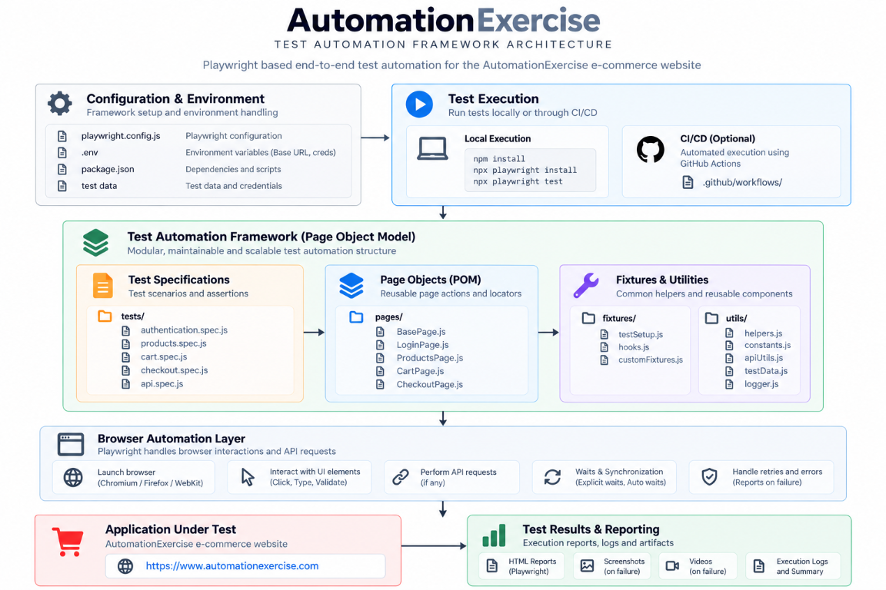
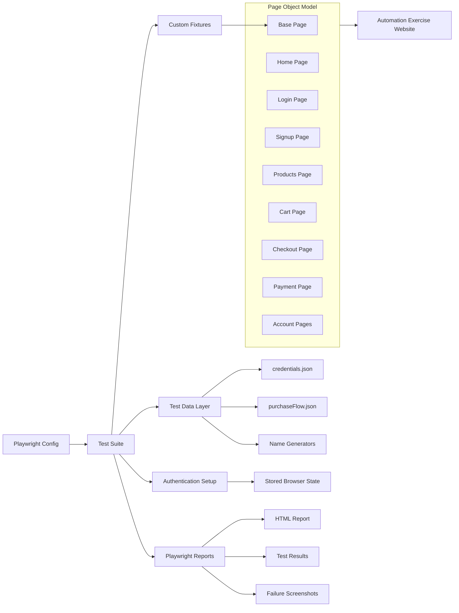

## Project Overview
This project is a Playwright based automation framework for the Automation Exercise web application. It follows a layered test architecture that separates browser automation, page interactions, reusable fixtures, test data, and execution flow. The design is focused on maintainability, readability, and reuse, which makes it suitable for both regression testing and interview presentation.

## Framework Architecture

### 1. Test Runner Layer
The foundation of the framework is Playwright itself. The configuration is defined in playwright.config.js and controls the core execution behavior of the suite.

Key responsibilities include:

- Defining the base URL for the application under test
- Setting default timeouts for navigation and assertions
- Configuring the browser project and environment setup
- Enabling HTML reporting for results
- Managing execution settings for CI and local runs
- Running setup tasks before browser tests

This layer ensures all tests start from a consistent environment and use a standard execution model.

### 2. Page Object Model Layer
The project uses the Page Object Model pattern to keep tests clean and maintainable. Each page or major UI area is represented by a dedicated class under src/pages.

Examples include:

- HomePage for home page checks and navigation
- LoginPage for login actions and validation
- SignupPage for account creation workflows
- ProductsPage for product listing and selection logic
- CartPage for item addition and cart verification
- CheckoutPage for shipping and order summary interactions
- PaymentPage and PaymentCompletedPage for payment flow validation
- NavigationTab for common header navigation actions
- ContactPage and other account management pages for feature-specific steps

Each class encapsulates:

- Page locators
- Reusable interaction methods
- Assertions for page state
- Business logic for a specific screen

This pattern reduces duplication and makes the test suite easier to evolve when the application changes.

### 3. Base Page Layer
The BasePage class in src/pages/Base.page.js acts as the shared parent for all page objects. It stores the Playwright page instance and gives every page object a consistent starting point.

This design keeps the framework simple while promoting a common structure across all page classes. It also makes future enhancements such as common wait logic, retry behavior, and shared page utilities easy to add without modifying every page class individually.

### 4. Fixture Layer
The custom fixtures are created in src/fixtures/Page.fixtures.js. This file extends the default Playwright test object with reusable page objects and automatically instantiates them for each test.

The fixture layer provides objects such as:

- homePage
- loginPage
- signupPage
- productsPage
- cartPage
- checkoutPage
- paymentPage
- paymentCompletedPage
- contactPage
- accountCreatedPage
- accountDeletedPage
- NavigationTab

Benefits of this layer:

- Tests do not need manual object creation
- Page objects are initialized consistently
- The suite is easier to read and maintain
- Test code remains focused on business flow rather than setup complexity

This is a strong architectural pattern for scalable automation suites.

### 5. Utility and Data Layer
The project separates dynamic data generation from static test input.

The src/utils directory contains helper logic for generating unique values for tests. For example, account details such as username, email, password, and last name are generated dynamically to avoid conflicts between repeated runs.

The testData folder contains reusable static inputs such as:

- credentials.json for default login accounts
- purchaseFlow.json for purchase workflow values

This separation gives the framework flexibility for both deterministic and randomized test scenarios.

### 6. Test Layer
The tests folder is organized by purpose and coverage type.

- tests/auth.setup.js performs authentication setup and stores browser state
- tests/modules contains page-focused tests; other pages are used only to establish the state needed to reach the page under test
- tests/scenario contains user-facing scenarios selected from the Automation Exercise test-case list
- tests/e2e contains end-to-end flow validation for the complete application journey

This organizes the suite into setup, reusable feature tests, and full business journey tests. It also helps with execution strategy, reporting, and future scaling.

### 7. Reporting and Artifacts Layer
The project includes generated artifacts such as:

- playwright-report for HTML reporting
- test-results for failure details and traces
- screenshots captured only on failure

This makes debugging simpler and gives stakeholders a clear visibility into failed scenarios.

Run the Playwright suite to generate the HTML report:

```sh
npm test
```

### Environment configuration

Copy `.env.example` to `.env` and set any local configuration there. `.env` is
ignored by Git, so values entered there are not committed. Avoid committing
credentials in any file.

| Variable | Purpose | Default |
| --- | --- | --- |
| `BASE_URL` | Application URL used by Playwright | `https://www.automationexercise.com` |
| `TEST_USER_EMAIL` | Email for the shared authentication setup | `testData/credentials.json` |
| `TEST_USER_PASSWORD` | Password for the shared authentication setup | `testData/credentials.json` |
| `TEST_USER_NAME` | Username expected after authentication | `testData/credentials.json` |
| `HEADLESS` | Run the browser headlessly when set to `true` | `false` |

Environment values take precedence over the credential JSON. Unset credential
values continue to use the existing test data, so `.env` is optional.

## Execution Flow
The framework follows a clear flow during test execution:

1. Playwright loads the configuration and test project settings.
2. The setup project authenticates a known user and stores session state.
3. Tests consume page fixtures that create page object instances.
4. Each test performs business actions by calling page object methods.
5. Assertions validate expected UI behavior and data states.
6. Results are reported through Playwright HTML output and test artifacts.

## Design Principles
This framework is built around a few important principles:

- Reusability: Shared logic is centralized in page objects and utilities.
- Maintainability: UI selectors and actions are kept close to their page definitions.
- Scalability: New pages and flows can be added without rewriting the core framework.
- Readability: Test files stay concise and business oriented.
- Reliability: Dynamic test data and shared authentication reduce flaky behavior.

## Architecture Diagram





## Final Takeaway
The architecture is intentionally organized to reflect how real automation frameworks are built in enterprise environments. It balances simplicity with scalability and demonstrates strong understanding of testing best practices, page abstraction, fixture-driven design, and modular test creation.
